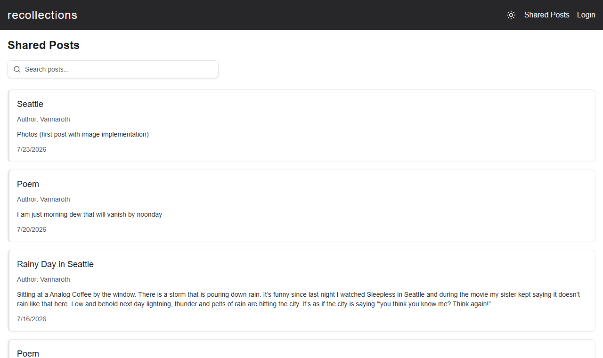
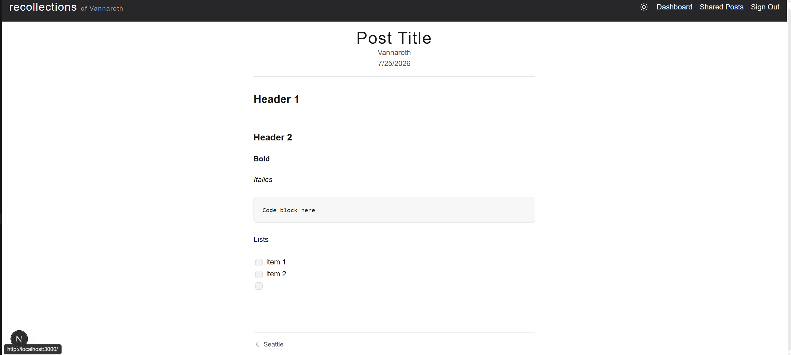
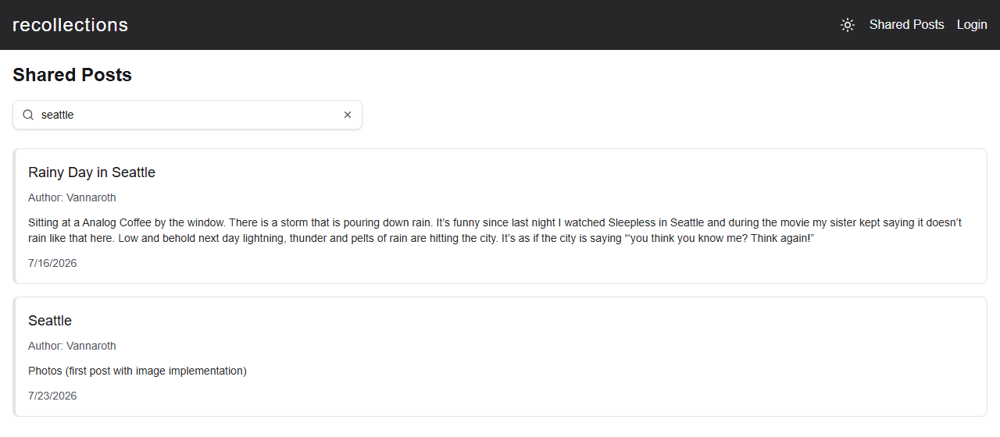

# recollections

A personal blog and reflection journal I built while between jobs — partly to document that time, partly to keep my engineering skills sharp, and partly because writing things down is the best way I know to make sense of them.

Posts can be **public** (shared on the blog) or **private** (visible only to the author), so the same app works as both a public blog and a personal journal.





**Live site:** [vann-recollections.vercel.app](https://vann-recollections.vercel.app/)

## Features

- **Email/password auth** via Neon Auth, with session-aware server components
- **Post CRUD** — create, edit, and delete posts, with author-only authorization enforced server-side
- **Public/private access levels** — private posts are filtered out of listings and fail closed on direct URL access
- **Rich text editing** with Tiptap, including inline image uploads stored on Vercel Blob
- **Full-text search** across post titles and bodies, backed by Postgres (`tsvector` + GIN index, title-weighted ranking) rather than a naive substring scan
- **Pagination** on both the public feed and the personal dashboard, including search results
- **Previous/next post navigation** ordered by post date
- **Responsive navigation** — collapses to a mobile hamburger menu that auto-closes on outside touch/click
- **Dark mode toggle** in the header, synced with OS preference on first visit and persisted across sessions
- **Form validation** with shared Zod schemas, checked server-side in Server Actions
- **Unit and component tests** with Jest and React Testing Library


## Tech stack


| Layer      | Choice                                                                                 |
| ---------- | -------------------------------------------------------------------------------------- |
| Framework  | [Next.js 16](https://nextjs.org) (App Router, React Server Components, Server Actions) |
| UI         | React 19, Tailwind CSS 4, Radix UI & Floating UI (editor dropdowns/popovers/tooltips)  |
| Database   | [Neon](https://neon.tech) serverless Postgres, queried with tagged-template SQL        |
| Search     | Postgres full-text search (`tsvector`/`tsquery`, GIN index, trigger-maintained)        |
| Storage    | Vercel Blob (post images)                                                              |
| Auth       | Neon Auth (`@neondatabase/auth`)                                                       |
| Validation | Zod 4 schemas, checked server-side inside Server Actions                              |
| Testing    | Jest 30, React Testing Library                                                         |
| Hosting    | Vercel, with Analytics and Speed Insights                                              |


## Architecture notes

A few decisions I made deliberately:

- **Server-first data access.** All queries and mutations live in `lib/` and are marked `server-only`, so database code can never leak into a client bundle. Pages are async server components that fetch directly.
- **Server Actions over API routes, with two necessary exceptions.** Mutations (`lib/posts/actions.ts`) are Server Actions that validate input with Zod, check the session, verify authorship, and then call the data layer — keeping authorization next to the mutation it protects. Route Handlers exist only where a real URL is unavoidable: `/api/upload` (Tiptap's image upload needs a fetchable endpoint) and `/api/file` (serving private post images requires an access check before streaming the blob).
- **Authorization at every entry point.** Listing queries filter by access level in SQL; the post detail and edit pages re-check access/authorship server-side, so private posts aren't reachable by URL guessing.
- **Plain SQL over an ORM.** Queries use Neon's tagged-template driver directly. For an app this size I wanted to stay close to the SQL rather than learn an ORM's abstraction over it.
- **Search and pagination live in the URL, not client state.** Both drive the same server-rendered query (`?q=`, `?page=`), so there's one data-fetching path, results are bookmarkable/shareable, and there's no separate client-side fetch/API route to keep in sync with the server-rendered list.
- **Search runs in Postgres, not the app.** A trigger-maintained `tsvector` column plus a GIN index (`sql/add_search_vector.sql`) means matching is an indexed lookup, not an app-side scan that re-parses every post's content on every keystroke.




## Project structure

```
app/          Routes (App Router): posts feed, post detail, create/edit, auth, dashboard
ui/           Presentational components (PostCard, forms, header, ...)
components/   Tiptap rich-text editor (vendored template) and landing-page effects
hooks/        Shared client hooks (dark mode, throttling, editor helpers, ...)
lib/          Data layer: SQL queries, server actions, auth helpers, db client
schemas/      Zod schemas shared by forms and server actions
type/         TypeScript row/input types for posts
sql/          One-off SQL migrations run manually against Neon (no ORM/migration tool)
__tests__/    Jest unit and component tests
```


## Running locally

You'll need Node 20+ and a [Neon](https://neon.tech) project with Neon Auth enabled.

1. Clone the repo and install dependencies:
  ```bash
   npm install
  ```
2. Create a `.env.local` file with your Neon credentials (the connection string and Neon Auth keys from the Neon console):
  ```bash
   DATABASE_URL=...
   NEON_AUTH_BASE_URL=...
   NEON_AUTH_COOKIE_SECRET=...
   BLOB_READ_WRITE_TOKEN=...
  ```
3. Run the SQL migrations in `sql/` against your database (via the Neon console's SQL editor or `psql`) to set up full-text search.
4. Start the dev server:
  ```bash
   npm run dev
  ```
   Then open [http://localhost:3000](http://localhost:3000).


## Tests

```bash
npm test              # run the suite once
npm run test:watch    # watch mode
npm run test:coverage # with coverage report
```


## Roadmap

**Done — rich text & media**

- [x] Tiptap editor in the post form, replacing the plain textarea
- [x] Store post content as structured Tiptap JSON and render it back through the same editor, read-only
- [x] Image uploads in the editor, stored on Vercel Blob

**Done — discovery**

- [x] Full-text search across posts (Postgres FTS: `tsvector` + GIN index, title/body weighted ranking)

**Next**

- [ ] Tags on posts — create, and filter the feed by tag
- [ ] Public homepage surfacing recent posts

**Later — reflection and reach**

- [ ] Calendar/streak view for reflection
- [ ] RSS feed + SEO/Open Graph metadata
